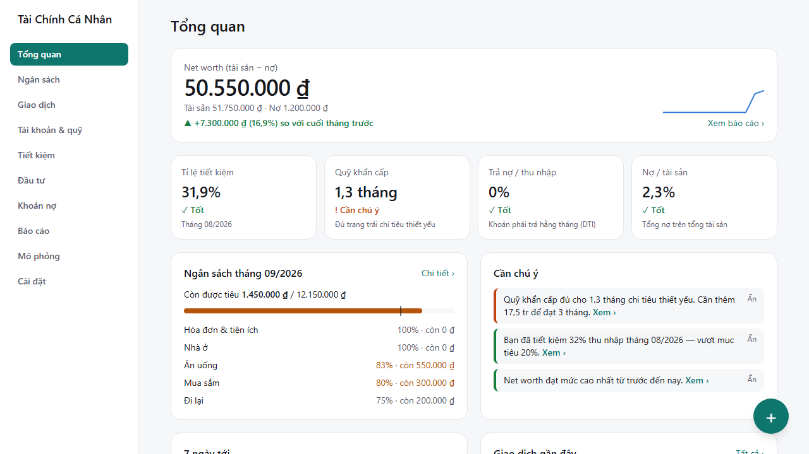
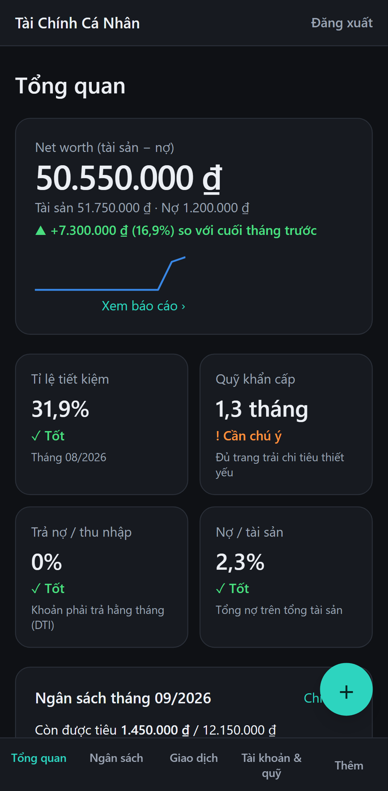
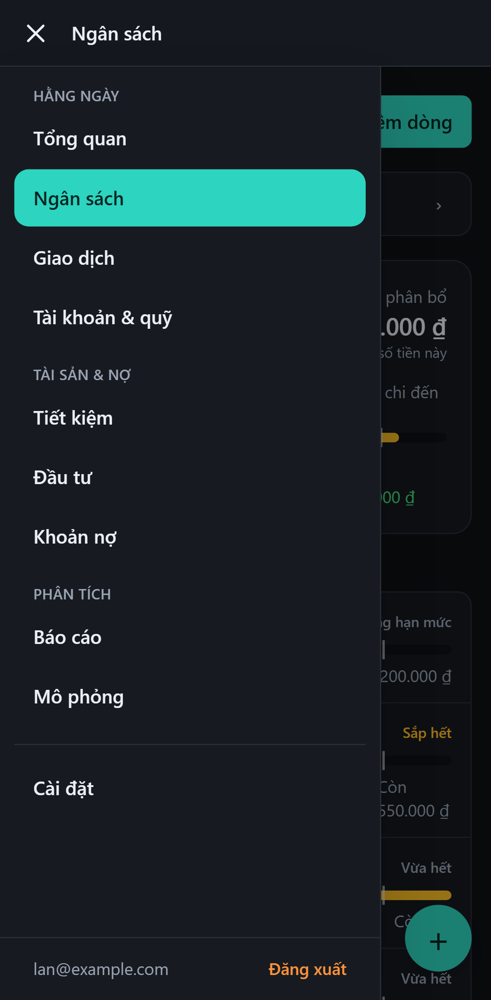
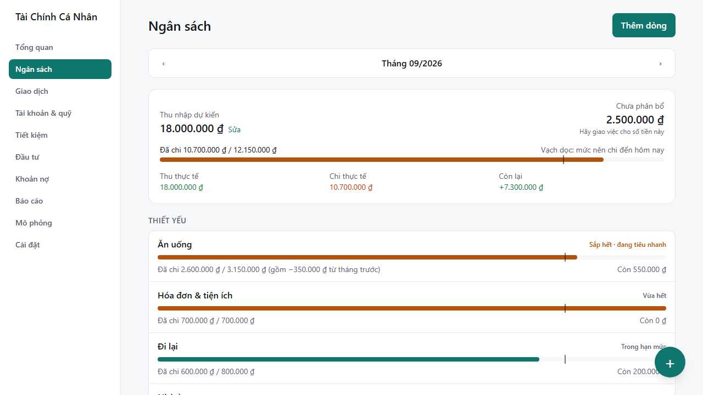
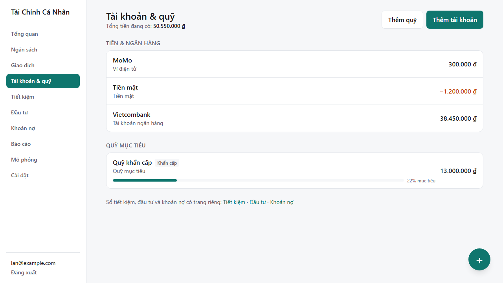
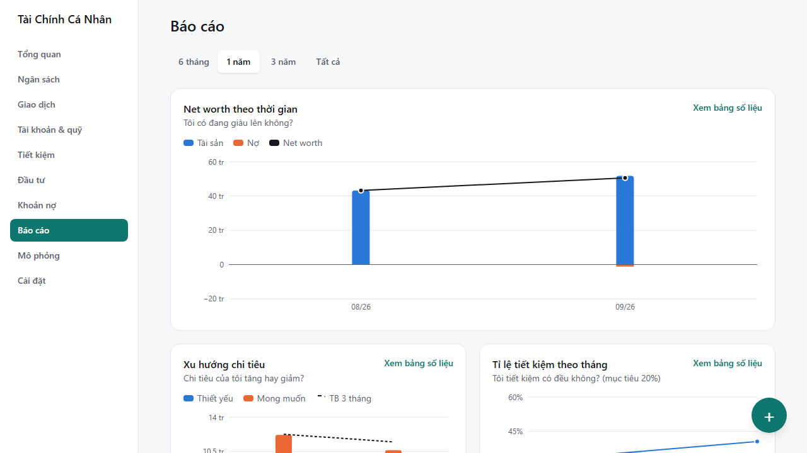
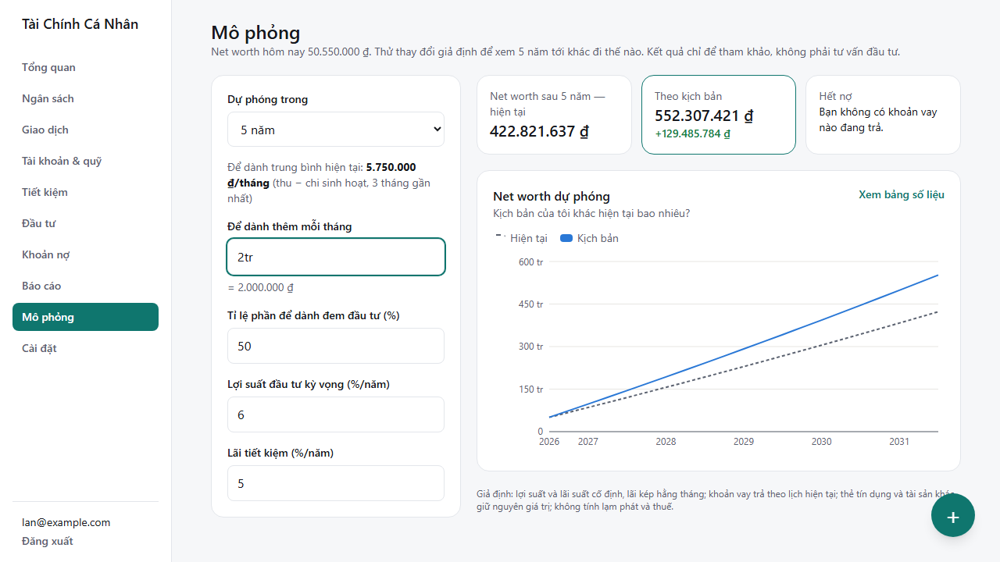
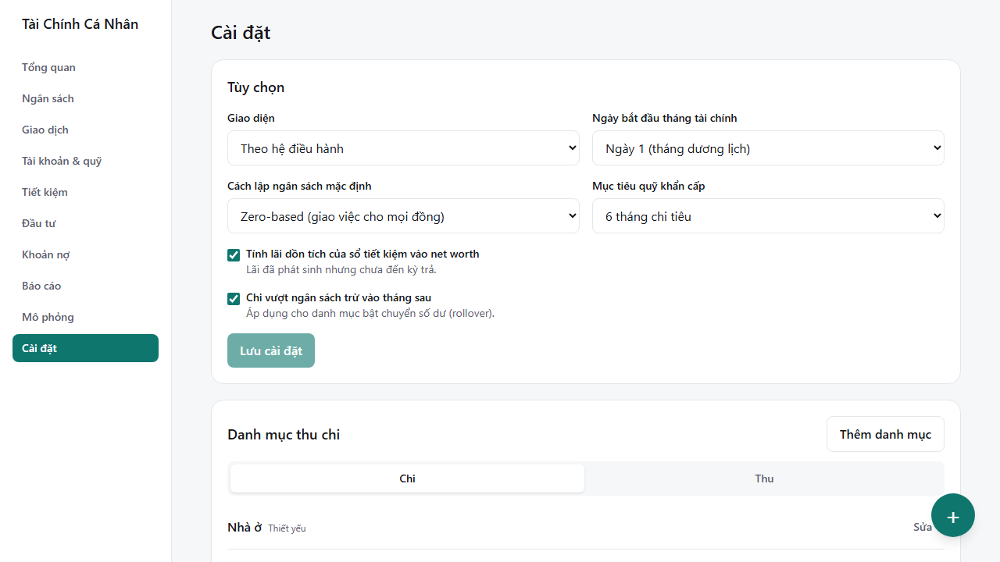

# 11 — Hướng dẫn khám phá Tài Chính Cá Nhân

> Dành cho **người dùng** (không cần biết lập trình). Đọc 10 phút; làm theo mục 2 là bạn đã có một tháng tài chính hoàn chỉnh.

---

## 1. App này giúp bạn điều gì?

| Câu hỏi của bạn | Trả lời ở đâu |
|---|---|
| Tháng này tôi còn được tiêu bao nhiêu? | **Ngân sách** |
| Tiền của tôi đi đâu? | **Báo cáo** → Xu hướng chi tiêu, Chi tiêu theo ngày |
| Tôi có đang giàu lên không? | **Tổng quan** → Net worth · **Báo cáo** → Net worth theo thời gian |
| Quỹ khẩn cấp đủ chưa? Có nợ quá nhiều không? | **Tổng quan** → 4 chỉ số sức khỏe |
| Sổ tiết kiệm bao giờ đáo hạn, lãi bao nhiêu? | **Tiết kiệm** |
| Cổ phiếu / vàng / chứng chỉ quỹ đang lãi hay lỗ? | **Đầu tư** |
| Bao giờ trả xong khoản vay? Trả trước có lợi không? | **Khoản nợ**, **Mô phỏng** |

### 5 khái niệm cần biết

- **Net worth (tài sản ròng)** = mọi thứ bạn có (tiền, sổ tiết kiệm, đầu tư, tài sản khác) − mọi khoản bạn nợ (vay, thẻ tín dụng, trả góp). Đây là con số "giàu hay nghèo" thật sự.
- **Ngân sách zero-based** (mặc định): giao việc cho **mọi đồng** thu nhập — chi tiêu, để dành vào quỹ hoặc trả nợ — cho đến khi "Chưa phân bổ" về 0. Không thích? Đổi sang "Thông thường" trong **Cài đặt**.
- **Tháng tài chính**: mặc định từ ngày 1. Lương về ngày 25? Chọn ngày bắt đầu là 25 — tháng 10 của bạn sẽ là 25/10 → 24/11.
- **Tài khoản** không chỉ là tài khoản ngân hàng: ví điện tử, tiền mặt, quỹ mục tiêu, sổ tiết kiệm, tài khoản chứng khoán, tài sản khác, khoản vay, thẻ tín dụng… đều là "tài khoản" có số dư.
- **Chuyển tiền** giữa hai tài khoản của bạn (VD: rút ATM, nạp quỹ, trả thẻ) **không phải chi tiêu** — net worth không đổi.

---

## 2. Bắt đầu trong 5 phút

1. **Đăng ký** bằng email → mở email xác nhận → **Đăng nhập**.
2. Làm theo **hướng dẫn bắt đầu** (5 bước, dừng giữa chừng được — lần sau tiếp tục đúng bước):
   1. Ngày bắt đầu tháng tài chính và cách lập ngân sách.
   2. Bộ danh mục: *Cơ bản* (gọn) hoặc *Chi tiết* (có danh mục con).
   3. Tài khoản tiền đang có và **số dư hôm nay** (xem app ngân hàng / đếm ví).
   4. Quỹ khẩn cấp (có thể bỏ qua).
   5. Thu nhập hằng tháng → app gợi ý chia 50/30/20.
3. Muốn **xem thử trước**? Ở bước đầu tiên bấm **"Xem dữ liệu demo"** → app nạp dữ liệu của *Lan* (xem mục 6). Khi muốn dùng thật: **Cài đặt → Xóa toàn bộ dữ liệu**.

> 💡 Mẹo gõ số tiền: `150k` = 150.000 · `2tr` = 2.000.000 · `2,5tr` = 2.500.000 · `1ty` = 1.000.000.000 · `1.234.567` cũng được.

---

## 3. Tour từng màn hình

Trên máy tính: thanh bên trái. Trên điện thoại: nút **☰** ở góc trên bên trái mở menu trượt với đủ các trang, chia 3 nhóm *Hằng ngày · Tài sản & nợ · Phân tích*, cùng Cài đặt và Đăng xuất ở cuối; thanh trên cùng luôn ghi tên trang đang xem. Nút **＋** tròn ở góc dưới bên phải có mặt ở mọi trang để ghi giao dịch nhanh.

| Trang chủ trên điện thoại | Menu ☰ đang mở |
|---|---|
|  |  |

### 3.1 Tổng quan
- **Net worth** và thay đổi so với cuối tháng trước; đường nhỏ bên phải = 12 tháng gần nhất.
- **4 chỉ số sức khỏe** (✓ Tốt · • Trung bình · ! Cần chú ý):
  - *Tỉ lệ tiết kiệm* = (thu − chi) / thu của tháng trước. Tốt ≥ 20%.
  - *Quỹ khẩn cấp* = tiền dễ rút (tiền mặt, ngân hàng, ví, quỹ khẩn cấp) chia chi tiêu thiết yếu trung bình 3 tháng. Tốt ≥ 6 tháng.
  - *Trả nợ / thu nhập (DTI)*: tổng phải trả hằng tháng / thu nhập. Tốt ≤ 30%.
  - *Nợ / tài sản*. Tốt ≤ 30%.
- **Ngân sách tháng**: còn được tiêu bao nhiêu, 5 danh mục đáng chú ý nhất.
- **Cần chú ý**: tối đa 5 gợi ý (vượt ngân sách, quỹ khẩn cấp thiếu, giá đầu tư cũ, trả trước khoản vay có lợi…). Bấm **Ẩn** nếu không muốn thấy lại.
- **7 ngày tới**: kỳ trả nợ, sổ đáo hạn, giao dịch định kỳ.
- **Nhắc sao lưu** khi đã hơn 30 ngày chưa sao lưu.

### 3.2 Ngân sách

- Tháng chưa có ngân sách → chọn cách tạo: **Sao chép tháng trước**, **Theo quy tắc 50/30/20** (chia theo mức chi thực tế gần đây) hoặc **Bắt đầu trống**.
- Mỗi dòng: thanh tiến độ + **vạch dọc = mức nên chi đến hôm nay**. Thanh vượt vạch → đang tiêu nhanh hơn kế hoạch.
- Trạng thái: *Trong hạn mức* → *Sắp hết* (≥ 80%) → *Vừa hết* → *Vượt*.
- Dòng có thể là **danh mục chi** (chọn nhóm cha để gom cả danh mục con) hoặc **quỹ / khoản nợ** (tiền chuyển vào quỹ / trả nợ trong tháng được tính là đã làm).
- **Chuyển phần dư / thiếu sang tháng sau** (rollover): hợp với khoản không đều như ăn uống, quà tặng.
- Cuối tháng bấm **Đóng tháng** → xem tổng kết (thu, chi, tỉ lệ tiết kiệm, chi nhiều nhất, vượt ngân sách, net worth) và tạo luôn ngân sách tháng sau. Tháng đã đóng bị khóa; **Mở lại tháng** nếu cần sửa.

### 3.3 Giao dịch
- 5 loại: **Chi**, **Thu**, **Chuyển** (giữa hai tài khoản của bạn), **Hoàn tiền** (tiền trả lại cho một khoản đã chi — làm giảm chi tiêu của danh mục đó), **Điều chỉnh** (sửa số dư cho khớp thực tế).
- Lọc theo tháng, loại, tài khoản, danh mục; ô **Tìm kiếm** tìm theo ghi chú và tên danh mục.
- Xóa nhầm? Bấm **Hoàn tác** trong 5 giây.
- **Giao dịch định kỳ** (lương, tiền nhà, internet…): *Tự động* (app tự ghi khi đến ngày) hoặc *Chờ xác nhận* (app hỏi trước, bạn sửa số tiền rồi xác nhận). Ngày 31 gặp tháng ngắn → ghi vào ngày cuối tháng.

### 3.4 Tài khoản & quỹ

- Nhóm theo loại, tổng tài sản / nợ ở đầu trang. Bấm một tài khoản → lịch sử giao dịch và số dư chạy.
- **Quỹ mục tiêu**: đặt số tiền và ngày cần → app tính mỗi tháng cần góp bao nhiêu và dự báo ngày đạt theo tốc độ góp 3 tháng gần nhất.
- **Đối soát số dư**: nhập *Số dư thực tế* → app tạo giao dịch *Điều chỉnh số dư* cho phần chênh (không tính vào chi tiêu).
- **Lưu trữ** tài khoản không dùng nữa: lịch sử giữ nguyên, không còn hiện khi ghi giao dịch.
- **Nhập sai?** Mọi loại tài khoản (kể cả sổ tiết kiệm, đầu tư, khoản vay, thẻ) có hàng *Sửa thông tin · Lưu trữ · Xóa…* ở cuối khung đầu trang:
  - Sai **số dư ban đầu / ngày bắt đầu / thông tin** (hạn mức, lãi suất, ngày trả…) → **Sửa thông tin**. App kiểm tra lại cả lịch sử (dư nợ không âm, tiền mặt không âm, không có giao dịch trước ngày bắt đầu).
  - Số dư đúng lúc đầu nhưng **lệch dần** so với ngân hàng → **Đối soát số dư**, không sửa số dư ban đầu.
  - Nhập nhầm **cả tài khoản** → **Xóa…**: app liệt kê những gì sẽ mất (giao dịch, cả nhóm trả nợ, lệnh, dòng ngân sách, giao dịch định kỳ) trước khi xóa vĩnh viễn.

### 3.5 Tiết kiệm
- **Mở sổ**: *Sổ mới — trích tiền từ tài khoản* hoặc *Sổ đã có từ trước*. Chọn kỳ hạn, lãi suất, cách nhận lãi (*Cuối kỳ*, *Hằng tháng*, *Trả trước*), xử lý khi đáo hạn (*Tái tục gốc, nhận lãi* / *Tái tục cả gốc lẫn lãi* / *Tất toán*).
- Trang chi tiết: lãi dồn tích đến hôm nay, các kỳ gửi, **Xử lý đáo hạn** và **Rút trước hạn** (app tính lãi không kỳ hạn và cho bạn sửa lãi thực nhận theo ngân hàng).
- Lãi trả hằng tháng được app tự ghi vào tài khoản nhận lãi.

### 3.6 Đầu tư
- **Tài khoản đầu tư** (chứng khoán, chứng chỉ quỹ, vàng, crypto): thêm mã → ghi lệnh mua/bán với phí và thuế → **Cập nhật giá** → xem giá vốn trung bình, lãi/lỗ chưa thực hiện và đã thực hiện.
- Vị thế mua từ trước khi dùng app: tích **Vị thế đã có từ trước (không trừ tiền)**.
- **Tài sản khác** (nhà, xe…): **Định giá lại** khi giá thay đổi; bán thì ghi tiền nhận về.

### 3.7 Khoản nợ
- **Khoản vay**: ngân hàng, vay người thân, trả góp. Cách tính lãi *dư nợ giảm dần (gốc đều)* hoặc *trả góp đều (annuity)*; lãi thả nổi → **Đổi lãi suất** từ một ngày.
- **Ghi trả kỳ này**: app tự tách gốc và lãi theo lịch; lãi ghi vào danh mục hệ thống *Lãi vay*.
- **Trả trước**: xem trước lãi tiết kiệm được (đã trừ phí), chọn **Giảm kỳ hạn** hay **Giảm khoản trả** mỗi kỳ.
- **Thẻ tín dụng**: hạn mức, ngày sao kê, hạn thanh toán, **Bao lâu thì trả hết?** nếu mỗi tháng trả X. Trả ít hơn tiền lãi → app cảnh báo "không bao giờ trả hết".

### 3.8 Báo cáo

Chọn khoảng thời gian (6 tháng · 1 năm · 3 năm · Tất cả). Mỗi biểu đồ có chú thích và nút **Xem bảng số liệu**.
- *Net worth theo thời gian*, *Xu hướng chi tiêu* (thiết yếu / mong muốn + trung bình 3 tháng), *Tỉ lệ tiết kiệm theo tháng* (mục tiêu 20%).
- *Chi tiết theo tháng*: **Vì sao net worth thay đổi?** (đầu kỳ → thu nhập, chi tiêu, thị trường, định giá lại, lãi dồn tích → cuối kỳ), *Kế hoạch vs thực tế*, *Thu nhập đi đâu?* (50/30/20), *Chi tiêu theo ngày* (lịch nhiệt).
- *Tài sản & nợ*: phân bổ tài sản, hiệu quả đầu tư, lộ trình trả nợ, gốc và lãi mỗi kỳ, tiến độ quỹ mục tiêu, lịch đáo hạn tiết kiệm.

### 3.9 Mô phỏng (what-if)

Thử "nếu… thì…": để dành thêm mỗi tháng, tỉ lệ đem đầu tư, lợi suất kỳ vọng, trả nợ thêm hằng tháng hoặc trả trước một lần → so sánh net worth và ngày hết nợ giữa *hiện tại* và *kịch bản*. Chỉ để tham khảo, không phải tư vấn tài chính.

### 3.10 Cài đặt

- **Tùy chọn**: giao diện Sáng / Tối / Theo hệ điều hành; ngày bắt đầu tháng (⚠️ đổi sẽ tính lại khoảng ngày của *mọi* tháng — giao dịch không bị sửa); cách lập ngân sách mặc định; mục tiêu quỹ khẩn cấp; tính lãi dồn tích vào net worth; cho phần chi vượt trừ vào tháng sau.
- **Danh mục thu chi**: thêm, đổi tên, chuyển nhóm, đổi nhóm 50/30/20, **Lưu trữ**. **Xóa** chỉ được khi chưa dùng; đã dùng thì **Gộp…** vào danh mục khác (giao dịch, ngân sách, định kỳ chuyển theo, tổng chi không đổi). Danh mục *hệ thống* (lãi vay, phí, lãi tiết kiệm…) chỉ đổi được tên.
- **Dữ liệu & sao lưu**: *Tải file sao lưu (JSON)*, *Xuất giao dịch (CSV)* mở bằng Excel, *Khôi phục từ file…*, *Nạp dữ liệu demo…*, *Xóa toàn bộ dữ liệu…* (gõ `XÓA` để xác nhận). Trước mọi thao tác thay thế/xóa, app **tự sao lưu** dữ liệu hiện tại lên máy chủ (hoặc tải về máy nếu không được).
- **Kết nối Claude**: địa chỉ để thêm app làm *custom connector* trong Claude, danh sách ứng dụng đang có quyền và nút *Thu hồi* (xem mục 3.11).
- **Tài khoản đăng nhập**: đổi mật khẩu, đăng xuất.

### 3.11 Dùng cùng Claude
Sau khi kết nối (docs/12), bạn trò chuyện với Claude trên web hoặc điện thoại:
- *Gửi ảnh hóa đơn*: "Ghi giúp, trả bằng tiền mặt" → Claude đọc ảnh, tóm tắt khoản sẽ ghi, bạn đồng ý là xong. Gửi lại cùng hóa đơn → Claude được cảnh báo trùng.
- *Hỏi*: "Tháng này tôi còn được tiêu bao nhiêu cho ăn uống?", "Xuất báo cáo tháng trước", "Vẽ net worth 6 tháng".
- *Lập kế hoạch*: "Lập ngân sách tháng sau giống tháng này nhưng tăng ăn uống lên 4 triệu".
- Giao dịch Claude ghi có thẻ `claude`; mọi kiểm tra (tiền mặt âm, vượt hạn mức, tháng đã đóng…) giống hệt khi bạn tự nhập.

---

## 4. Chu kỳ một tháng (làm theo là đủ)

| Khi nào | Việc | Mất |
|---|---|---|
| Đầu tháng | **Ngân sách** → tạo ngân sách (sao chép tháng trước), chỉnh vài dòng đến khi *Chưa phân bổ* = 0 | 3 phút |
| Mỗi ngày / mỗi lần chi | Nút **＋** → số tiền → danh mục → Lưu (Enter) | 10 giây |
| Khi nhận thông báo | Xác nhận giao dịch định kỳ, ghi trả nợ, xử lý sổ đáo hạn (hiện ở *7 ngày tới*) | 1 phút |
| Mỗi tuần | Xem **Ngân sách**: dòng nào vượt vạch dọc? Cập nhật giá đầu tư | 2 phút |
| Cuối tháng | **Đối soát số dư** các tài khoản chính → **Đóng tháng** → đọc tổng kết | 5 phút |
| Mỗi tháng | **Cài đặt → Tải file sao lưu** | 10 giây |

---

## 5. Tình huống thường gặp

| Tình huống | Ghi thế nào |
|---|---|
| Rút ATM 2 triệu | **Chuyển**: Ngân hàng → Tiền mặt |
| Trả thẻ tín dụng | **Chuyển**: Ngân hàng → Thẻ (không phải chi tiêu — chi tiêu đã ghi lúc quẹt thẻ) |
| Góp quỹ khẩn cấp | **Chuyển**: Ngân hàng → Quỹ khẩn cấp (tính là đã làm nếu ngân sách có dòng cho quỹ) |
| Được hoàn tiền đơn hàng | **Hoàn tiền** vào đúng danh mục đã chi |
| Cho bạn vay 5 triệu | Tạo tài khoản *Tài sản khác* "Cho Nam vay" rồi **Chuyển** vào đó |
| Số dư app lệch ngân hàng | Trang tài khoản → **Đối soát số dư** |
| Chia hóa đơn nhà hàng | Ghi phần của bạn là **Chi**; phần bạn trả hộ → **Chuyển** sang tài khoản "Cho vay" |
| Lương về giữa tháng | **Cài đặt** → ngày bắt đầu tháng = ngày nhận lương |

---

## 6. Dữ liệu demo — 3 nhân vật

Nạp trong **Cài đặt → Nạp dữ liệu demo…** (hoặc nút *Xem dữ liệu demo* lúc bắt đầu). Ngày được dời để tháng chính của nhân vật là **tháng vừa qua**.

| Nhân vật | Tình huống | Nên xem |
|---|---|---|
| **Lan** — nhân viên văn phòng | Lương 18 tr, ngân sách zero-based, quỹ khẩn cấp, một tháng đầy đủ + tháng này đang chạy | Tổng quan: net worth **43.250.000 ₫**, tỉ lệ tiết kiệm **31,9%**, quỹ khẩn cấp **1,3 tháng** (! Cần chú ý) · Ngân sách tháng trước: *Ăn uống vượt 350.000 ₫* chuyển sang tháng này · Báo cáo → *Vì sao net worth thay đổi?* |
| **Hùng** — vay mua nhà | Vay 1,2 tỷ, 20 năm, 9%/năm, gốc đều; sổ tiết kiệm 6 tháng | Khoản nợ → lịch trả nợ, **Trả trước** (xem lãi tiết kiệm), **Đổi lãi suất** · Tiết kiệm → lãi dồn tích, đáo hạn · Mô phỏng → trả thêm mỗi tháng |
| **Mai** — freelancer | Thu nhập không đều, cổ phiếu FPT + chứng chỉ quỹ, thẻ tín dụng | Đầu tư → giá vốn TB, lãi đã thực hiện khi bán 600 cp (**8.400.000 ₫**) · Khoản nợ → thẻ: trả 1 tr/tháng mất **29 tháng** · Báo cáo → hiệu quả đầu tư |

Xong? **Cài đặt → Xóa toàn bộ dữ liệu** và bắt đầu với số liệu thật của bạn.

---

## 7. Câu hỏi thường gặp

**Dữ liệu của tôi nằm ở đâu, ai xem được?**
Trong cơ sở dữ liệu Supabase của chủ app. Mỗi dòng dữ liệu gắn với tài khoản của bạn và được bảo vệ bằng *Row Level Security*: người khác đăng nhập cũng không đọc được. App không kết nối ngân hàng, không lưu mật khẩu ngân hàng.

**Tôi có cần nhập mọi giao dịch nhỏ không?**
Không bắt buộc. Tối thiểu: thu nhập, các khoản chi lớn và trả nợ; cuối tháng **Đối soát số dư** để phần lẻ vào *Điều chỉnh*. Nhập càng đủ, báo cáo càng đúng.

**Sao "Tỉ lệ tiết kiệm" hiện "Chưa đủ dữ liệu"?**
Tháng trước chưa có thu nhập nào được ghi. Chỉ số tính theo tháng đã kết thúc.

**Net worth giảm dù tôi không tiêu gì?**
Xem **Báo cáo → Vì sao net worth thay đổi?**: thường do giá đầu tư giảm (*Thị trường*), định giá lại tài sản, hoặc trả lãi vay.

**Tôi sửa một giao dịch của tháng đã đóng thì sao?**
App hỏi xác nhận. Số liệu các tháng sau (net worth lịch sử) được tính lại tự động.

**Mất mạng giữa lúc lưu?**
Các thao tác nhiều bước (trả nợ = gốc + lãi + phí, mua cổ phiếu = lệnh + phí + tiền) được lưu trong **một giao dịch cơ sở dữ liệu**: hoặc lưu đủ, hoặc không lưu gì. Thử lại là được — app không tạo trùng.

**Dùng trên nhiều thiết bị?**
Được. Đăng nhập cùng email; dữ liệu tự làm mới khi bạn quay lại tab.

**Khôi phục file sao lưu có ghi đè không?**
Có — thay **toàn bộ** dữ liệu bằng nội dung file. Trước đó app tự lưu một bản dữ liệu hiện tại. File hỏng hoặc không phải của app bị từ chối, dữ liệu hiện tại giữ nguyên.

**Tôi quên mật khẩu?**
Trang đăng nhập → **Quên mật khẩu?** → mở email → đặt mật khẩu mới.

**App có đưa lời khuyên đầu tư không?**
Không. Các gợi ý là phép tính dựa trên số liệu của bạn (VD: trả trước khoản vay lãi 9% tiết kiệm được bao nhiêu), chỉ để tham khảo.
